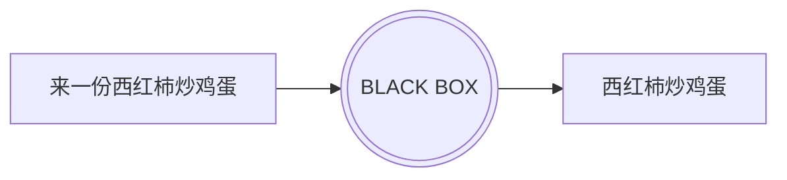
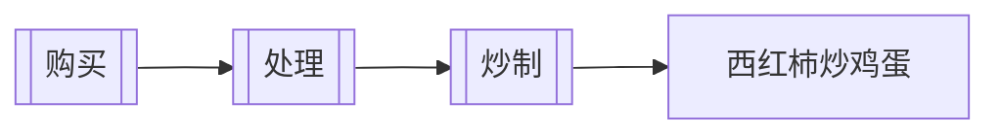

# Functional Programming

---
layout: table-of-contents
hideInToc: true
---

# Table of Contents

---

# Imperative Programming

In computer science, imperative programming is a programming paradigm of software that uses statements that change a program's state. In much the same way that the imperative mood in natural languages expresses commands, an imperative program consists of commands for the computer to perform. Imperative programming focuses on **describing how a program operates step by step**, rather than on high-level descriptions of its expected results.


---

# Declarative programming

In computer science, declarative programming is a programming paradigm—a style of building the structure and elements of computer programs—that expresses the logic of a computation without describing its control flow.



---

# Functional Programming

In computer science, **functional programming is a programming paradigm where programs are constructed by applying and composing functions.** 

In functional programming, **functions are treated as first-class citizens**, <u>*meaning that they can be bound to names (including local identifiers), passed as arguments, and returned from other functions, just as any other data type can.* </u>This allows programs to be written in a declarative and composable style, where small functions are combined in a modular manner.

Functional programming has its roots in academia, **evolving from the lambda calculus.**



* First-class and higher-order functions
* Pure functions
* Referential transparency

---

# λ Calculus

Lambda calculus (λ-calculus), originally created by Alonzo Church, is the world’s smallest programming language. Despite not having numbers, strings, booleans, or any non-function datatype, **lambda calculus can be used to represent any Turing Machine!**<sup>1</sup>

|Name|Syntax|Example|Explanation|
|---|---|---|---|
|Variable|`<name>`|`x`|a variable named “x”|
|Function|`λ<parameters>.<body>`|`λx.x`|a function with parameter “x” and body “x”|
|Application|`<function><variable or function>`|`(λx.x)a`|calling the function “λx.x” with argument “a”|

The most basic function is the identity function: `λx.x` which is equivalent to $f(x) = x$. The first “x” is the function’s argument, and the second is the body of the function.


<Footnotes separator>
  <Footnote :number=1><a href="https://learnxinyminutes.com/docs/lambda-calculus/" rel="noreferrer" target="_blank">Lambda Calculus</a></Footnote>
</Footnotes>

---

# Pure Functions

Pure functions (or expressions) have **no side effects (memory or I/O)**. This means that pure functions have several useful properties, many of which can be used to optimize the code:

* If the result of a pure expression is not used, it can be removed without affecting other expressions.
* If a pure function is called with arguments that cause no side-effects, the result is constant with respect to that argument list (sometimes called referential transparency or idempotence), i.e., **calling the pure function again with the same arguments returns the same result**. (This can enable caching optimizations such as memoization.)
* If there is no data dependency between two pure expressions, their order can be reversed, or they can be performed in parallel and they cannot interfere with one another (in other terms, the evaluation of any pure expression is thread-safe).
* If the entire language does not allow side-effects, then any evaluation strategy can be used; this gives the compiler freedom to reorder or combine the evaluation of expressions in a program (for example, using deforestation).

---

## Side Effect of Function

In computer science, an operation, function or expression is said to have a side effect if it **modifies some state variable value(s) outside its local environment**, which is to say if it has any observable effect other than its primary effect of returning a value to the invoker of the operation. <u>Example side effects include modifying a non-local variable, modifying a static local variable, modifying a mutable argument passed by reference, performing I/O or calling other functions with side-effects.</u> In the presence of side effects, a program's behaviour may depend on history; that is, the order of evaluation matters. Understanding and debugging a function with side effects requires knowledge about the context and its possible histories.

---

```python
x = 0
def setx(n):
    global x
    x = n
setx(3)
assert x == 3
setx(3)
assert x == 3
```

```python
def abs(n):
    return -n if n < 0 else n
assert abs(abs(-3)) == abs(-3)
```

```python
def hello(name: str):
  print('hello ', name)
  return 'hello ' + name
```

```python
def hello(name: str):
  return 'hello ' + name
```

---

## the function return values are identical for identical arguments

A function is a special relationship between values: Each of its input values gives back exactly one output value.

|||
|---|---|

<Footnotes separator>
  <Footnote><a href="https://www.mathsisfun.com/sets/function.html" rel="noreferrer" target="_blank">Function</a></Footnote>
</Footnotes>

---
layout: two-cols
---

## Why Pure Functions

* Determinacy
* No Side Effect

### Benefit

* Cacheable

::right::

```javascript
const squareNumber = memoize(x => x * x);

squareNumber(4); // 16

squareNumber(4); // 16, returns cache for input 4

squareNumber(5); // 25

squareNumber(5); // 25, returns cache for input 5
```

```javascript
const memoize = (f) => {
  const cache = {};

  return (...args) => {
    const argStr = JSON.stringify(args);
    cache[argStr] = cache[argStr] || f(...args);
    return cache[argStr];
  };
};
```

---
layout: two-cols
hideInToc: true
---

## Why Pure Functions

* Determinacy
* No Side Effect

### Benefit

* Cacheable
* Portable

::right::

```javascript
// impure
const signUp = (attrs) => {
  const user = saveUser(attrs);
  welcomeUser(user);
};

// pure
const signUp = (Db, Email, attrs) => () => {
  const user = saveUser(Db, attrs);
  welcomeUser(Email, user);
};
```

---
hideInToc: true
---

## Why Pure Functions

* Determinacy
* No Side Effect

### Benefit

* Cacheable
* Portable
* Testable


---
layout: two-cols
hideInToc: true
---

## Why Pure Functions

* Determinacy
* No Side Effect

### Benefit

* Cacheable
* Portable
* Testable
* Reasonable

::right::

```javascript
const { Map } = require('immutable');

// Aliases: p = player, a = attacker, t = target
const jobe = Map({ name: 'Jobe', hp: 20, team: 'red' });
const michael = Map({ name: 'Michael', hp: 20, team: 'green' });
const decrementHP = p => p.set('hp', p.get('hp') - 1);
const isSameTeam = (p1, p2) => p1.get('team') === p2.get('team');
const punch = (a, t) => (isSameTeam(a, t) ? t : decrementHP(t));

punch(jobe, michael); // Map({name:'Michael', hp:19, team: 'green'})
```

---
hideInToc: true
---

## Why Pure Functions

* Determinacy
* No Side Effect

### Benefit

* Cacheable
* Portable
* Testable
* Reasonable
* Parallel

---

# First-Class Functions

> a programming language is said to have first-class functions if it treats functions as first-class citizens.

A programming language is said to have First-class functions when **functions in that language are treated like any other variable**. For example, in such a language, <u>a function can be passed as an argument to other functions, can be returned by another function and can be assigned as a value to a variable</u>.


<Footnotes separator>
  <Footnote><a href="https://developer.mozilla.org/en-US/docs/Glossary/First-class_Function" rel="noreferrer" target="_blank">First-class Function</a></Footnote>
  <Footnote><a href="https://www.cs.uky.edu/~raphael/courses/CS655/Advanced_programming_language_design.pdf" rel="noreferrer" target="_blank">Advanced programming language design. Raphael Finkel. P65</a></Footnote>
</Footnotes>

---

```javascript
const foo = () => {
  console.log("foobar");
};
foo(); // Invoke it using the variable
// foobar
```

```javascript
function sayHello() {
  return "Hello, ";
}
function greeting(helloMessage, name) {
  console.log(helloMessage() + name);
}
// Pass `sayHello` as an argument to `greeting` function
greeting(sayHello, "JavaScript!");
// Hello, JavaScript!
```

```javascript
function sayHello() {
  return () => {
    console.log("Hello!");
  };
}
```


<Footnotes separator>
  <Footnote><a href="https://developer.mozilla.org/en-US/docs/Glossary/First-class_Function" rel="noreferrer" target="_blank">First-class Function</a></Footnote>
</Footnotes>

---

# Referential Transparency

In computer science, referential transparency and referential opacity are properties of parts of computer programs. An expression is called referentially transparent if it can be replaced with its corresponding value (and vice-versa) without changing the program's behavior. This requires that the expression be pure – **its value must be the same for the same inputs and its evaluation must have no side effects**. An expression that is not referentially transparent is called referentially opaque.

```c
int g = 0;

int rt(int x) {
  return x + 1;
}

int ro(int x) {
  g++;
  return x + g;
}
```

---

```c
int i = ro(x) + ro(y) * (ro(x) - ro(x));
```

```c
int i = ro(x) + ro(y) * 0;
int i = ro(x) + 0;
int i = ro(x);
```
<br />

```c
int tmp = g; int i = x + tmp + 1 + (y + tmp + 2) * (x + tmp + 3 - (x + tmp + 4)); g = g + 4;
int tmp = g; int i = x + tmp + 1 + (y + tmp + 2) * (x + tmp + 3 - x - tmp - 4)); g = g + 4;
int tmp = g; int i = x + tmp + 1 + (y + tmp + 2) * (-1); g = g + 4;
int tmp = g; int i = x + tmp + 1 - y - tmp - 2; g = g + 4;
int i = x - y - 1; g = g + 4;
```

Therefore, referential transparency allows us to reason about our code which will lead to more robust programs, the possibility of finding bugs that we couldn't hope to find by testing, and the possibility of seeing opportunities for optimization.

---

# Higher-Order Functions

In mathematics and computer science, a higher-order function (HOF) is a function that does at least one of the following:

* takes one or more functions as arguments (i.e. a procedural parameter, which is a parameter of a procedure that is itself a procedure),
* returns a function as its result.

## Why?

**Don't Repeat Yourself**

---

Suppose there is a scenario where we need to add log output to each business function.
* One way is to modify each function and add log output inside it.
* Another way is to unify a method to achieve the effect of hooks, so that every business function call will be followed by the call log output


---
layout: two-cols
---

```javascript
function arrAdd(arr) {
  const newArr = []  
  for(let i=0; i<arr.length; i++) {
    newArr.push(arr[i]+1)
  }
  return newArr
}  

function arrSub(arr) {
  const newArr = []  
  for(let i=0; i<arr.length; i++) {
    newArr.push(arr[i]-1)
  }
  return newArr
}
```

::right::

```javascript
function arrMult(arr) {
  const newArr = []  
  for(let i=0; i<arr.length; i++) {
    newArr.push(arr[i]*1)
  }
  return newArr
} 

function arrDivide(arr) {
  const newArr = []  
  for(let i=0; i<arr.length; i++) {
    newArr.push(arr[i]/1)
  }
  return newArr
} 
```

---

```javascript
function add(num) {
  return num + 1  
}

function sub(num) {
  return num - 1  
}

function mult(num) {
  return num * 1 
}  

function divide(num) {
  return num / 1
}

function arrCompute(arr, compute) {
  const newArr = []  
  for(let i=0; i<arr.length; i++) {
    newArr.push(compute(arr[i]))
  }
  return newArr
}
```