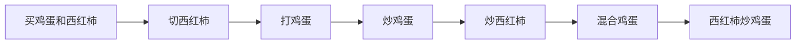
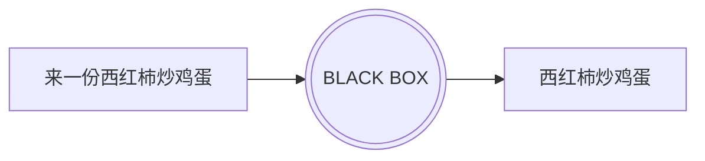
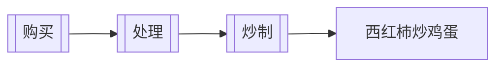

# Functional Programming

---
layout: table-of-contents
hideInToc: true
---

# Table of Contents

---

# Imperative Programming

In computer science, imperative programming is a programming paradigm of software that uses statements that change a program's state. In much the same way that the imperative mood in natural languages expresses commands, an imperative program consists of commands for the computer to perform. Imperative programming focuses on **describing how a program operates step by step**, rather than on high-level descriptions of its expected results.



---

# Declarative programming

In computer science, declarative programming is a programming paradigm—a style of building the structure and elements of computer programs—that expresses the logic of a computation without describing its control flow.



---

# Functional Programming

In computer science, **functional programming is a programming paradigm where programs are constructed by applying and composing functions.** 

In functional programming, **functions are treated as first-class citizens**, <u>*meaning that they can be bound to names (including local identifiers), passed as arguments, and returned from other functions, just as any other data type can.* </u>This allows programs to be written in a declarative and composable style, where small functions are combined in a modular manner.

Functional programming has its roots in academia, **evolving from the lambda calculus.**



* First-class and higher-order functions
* Pure functions
* Referential transparency

---

# λ Calculus

Lambda calculus (λ-calculus), originally created by Alonzo Church, is the world’s smallest programming language. Despite not having numbers, strings, booleans, or any non-function datatype, **lambda calculus can be used to represent any Turing Machine!**<sup>1</sup>

|Name|Syntax|Example|Explanation|
|---|---|---|---|
|Variable|`<name>`|`x`|a variable named “x”|
|Function|`λ<parameters>.<body>`|`λx.x`|a function with parameter “x” and body “x”|
|Application|`<function><variable or function>`|`(λx.x)a`|calling the function “λx.x” with argument “a”|

The most basic function is the identity function: `λx.x` which is equivalent to $f(x) = x$. The first “x” is the function’s argument, and the second is the body of the function.


<Footnotes separator>
  <Footnote :number=1><a href="https://learnxinyminutes.com/docs/lambda-calculus/" rel="noreferrer" target="_blank">Lambda Calculus</a></Footnote>
</Footnotes>

---

# Pure Functions

Pure functions (or expressions) have **no side effects (memory or I/O)**. This means that pure functions have several useful properties, many of which can be used to optimize the code:

* If the result of a pure expression is not used, it can be removed without affecting other expressions.
* If a pure function is called with arguments that cause no side-effects, the result is constant with respect to that argument list (sometimes called referential transparency or idempotence), i.e., **calling the pure function again with the same arguments returns the same result**. (This can enable caching optimizations such as memoization.)
* If there is no data dependency between two pure expressions, their order can be reversed, or they can be performed in parallel and they cannot interfere with one another (in other terms, the evaluation of any pure expression is thread-safe).
* If the entire language does not allow side-effects, then any evaluation strategy can be used; this gives the compiler freedom to reorder or combine the evaluation of expressions in a program (for example, using deforestation).

---
hideInToc: true
---

## Side Effect of Function

In computer science, an operation, function or expression is said to have a side effect if it **modifies some state variable value(s) outside its local environment**, which is to say if it has any observable effect other than its primary effect of returning a value to the invoker of the operation. <u>Example side effects include modifying a non-local variable, modifying a static local variable, modifying a mutable argument passed by reference, performing I/O or calling other functions with side-effects.</u> In the presence of side effects, a program's behaviour may depend on history; that is, the order of evaluation matters. Understanding and debugging a function with side effects requires knowledge about the context and its possible histories.

---

```python
x = 0
def setx(n):
    global x
    x = n
setx(3)
assert x == 3
setx(3)
assert x == 3
```

```python
def abs(n):
    return -n if n < 0 else n
assert abs(abs(-3)) == abs(-3)
```

```python
def hello(name: str):
  print('hello ', name)
  return 'hello ' + name
```

```python
def hello(name: str):
  return 'hello ' + name
```

---
hideInToc: true
---

## the function return values are identical for identical arguments

A function is a special relationship between values: Each of its input values gives back exactly one output value.

|||
|---|---|

<Footnotes separator>
  <Footnote><a href="https://www.mathsisfun.com/sets/function.html" rel="noreferrer" target="_blank">Function</a></Footnote>
</Footnotes>

---
layout: two-cols
hideInToc: true
---

## Why Pure Functions

* Determinacy
* No Side Effect

### Benefit

* Cacheable

::right::

```javascript
const squareNumber = memoize(x => x * x);

squareNumber(4); // 16

squareNumber(4); // 16, returns cache for input 4

squareNumber(5); // 25

squareNumber(5); // 25, returns cache for input 5
```

```javascript
const memoize = (f) => {
  const cache = {};

  return (...args) => {
    const argStr = JSON.stringify(args);
    cache[argStr] = cache[argStr] || f(...args);
    return cache[argStr];
  };
};
```

---
layout: two-cols
hideInToc: true
---

## Why Pure Functions

* Determinacy
* No Side Effect

### Benefit

* Cacheable
* Portable

::right::

```javascript
// impure
const signUp = (attrs) => {
  const user = saveUser(attrs);
  welcomeUser(user);
};

// pure
const signUp = (Db, Email, attrs) => () => {
  const user = saveUser(Db, attrs);
  welcomeUser(Email, user);
};
```

---
hideInToc: true
---

## Why Pure Functions

* Determinacy
* No Side Effect

### Benefit

* Cacheable
* Portable
* Testable


---
layout: two-cols
hideInToc: true
---

## Why Pure Functions

* Determinacy
* No Side Effect

### Benefit

* Cacheable
* Portable
* Testable
* Reasonable

::right::

```javascript
const { Map } = require('immutable');

// Aliases: p = player, a = attacker, t = target
const jobe = Map({ name: 'Jobe', hp: 20, team: 'red' });
const michael = Map({ name: 'Michael', hp: 20, team: 'green' });
const decrementHP = p => p.set('hp', p.get('hp') - 1);
const isSameTeam = (p1, p2) => p1.get('team') === p2.get('team');
const punch = (a, t) => (isSameTeam(a, t) ? t : decrementHP(t));

punch(jobe, michael); // Map({name:'Michael', hp:19, team: 'green'})
```

---
hideInToc: true
---

## Why Pure Functions

* Determinacy
* No Side Effect

### Benefit

* Cacheable
* Portable
* Testable
* Reasonable
* Parallel

---

# First-Class Functions

> a programming language is said to have first-class functions if it treats functions as first-class citizens.

A programming language is said to have First-class functions when **functions in that language are treated like any other variable**. For example, in such a language, <u>a function can be passed as an argument to other functions, can be returned by another function and can be assigned as a value to a variable</u>.


<Footnotes separator>
  <Footnote><a href="https://developer.mozilla.org/en-US/docs/Glossary/First-class_Function" rel="noreferrer" target="_blank">First-class Function</a></Footnote>
  <Footnote><a href="https://www.cs.uky.edu/~raphael/courses/CS655/Advanced_programming_language_design.pdf" rel="noreferrer" target="_blank">Advanced programming language design. Raphael Finkel. P65</a></Footnote>
</Footnotes>

---

```javascript
const foo = () => {
  console.log("foobar");
};
foo(); // Invoke it using the variable
// foobar
```

```javascript
function sayHello() {
  return "Hello, ";
}
function greeting(helloMessage, name) {
  console.log(helloMessage() + name);
}
// Pass `sayHello` as an argument to `greeting` function
greeting(sayHello, "JavaScript!");
// Hello, JavaScript!
```

```javascript
function sayHello() {
  return () => {
    console.log("Hello!");
  };
}
```


<Footnotes separator>
  <Footnote><a href="https://developer.mozilla.org/en-US/docs/Glossary/First-class_Function" rel="noreferrer" target="_blank">First-class Function</a></Footnote>
</Footnotes>

---

# Referential Transparency

In computer science, referential transparency and referential opacity are properties of parts of computer programs. An expression is called referentially transparent if it can be replaced with its corresponding value (and vice-versa) without changing the program's behavior. This requires that the expression be pure – **its value must be the same for the same inputs and its evaluation must have no side effects**. An expression that is not referentially transparent is called referentially opaque.

```c
int g = 0;

int rt(int x) {
  return x + 1;
}

int ro(int x) {
  g++;
  return x + g;
}
```

---

```c
int i = ro(x) + ro(y) * (ro(x) - ro(x));
```

```c
int i = ro(x) + ro(y) * 0;
int i = ro(x) + 0;
int i = ro(x);
```
<br />

```c
int tmp = g; int i = x + tmp + 1 + (y + tmp + 2) * (x + tmp + 3 - (x + tmp + 4)); g = g + 4;
int tmp = g; int i = x + tmp + 1 + (y + tmp + 2) * (x + tmp + 3 - x - tmp - 4)); g = g + 4;
int tmp = g; int i = x + tmp + 1 + (y + tmp + 2) * (-1); g = g + 4;
int tmp = g; int i = x + tmp + 1 - y - tmp - 2; g = g + 4;
int i = x - y - 1; g = g + 4;
```

Therefore, referential transparency allows us to reason about our code which will lead to more robust programs, the possibility of finding bugs that we couldn't hope to find by testing, and the possibility of seeing opportunities for optimization.

---

# Higher-Order Functions

In mathematics and computer science, a higher-order function (HOF) is a function that does at least one of the following:

* takes one or more functions as arguments (i.e. a procedural parameter, which is a parameter of a procedure that is itself a procedure),
* returns a function as its result.

## Why?

**Don't Repeat Yourself**

---

Suppose there is a scenario where we need to add log output to each business function.
* One way is to modify each function and add log output inside it.
* Another way is to unify a method to achieve the effect of hooks, so that every business function call will be followed by the call log output


---
layout: two-cols
---

```javascript
function arrAdd(arr) {
  const newArr = []  
  for(let i=0; i<arr.length; i++) {
    newArr.push(arr[i]+1)
  }
  return newArr
}  

function arrSub(arr) {
  const newArr = []  
  for(let i=0; i<arr.length; i++) {
    newArr.push(arr[i]-1)
  }
  return newArr
}
```

::right::

```javascript
function arrMult(arr) {
  const newArr = []  
  for(let i=0; i<arr.length; i++) {
    newArr.push(arr[i]*1)
  }
  return newArr
} 

function arrDivide(arr) {
  const newArr = []  
  for(let i=0; i<arr.length; i++) {
    newArr.push(arr[i]/1)
  }
  return newArr
} 
```

---

```javascript
function add(num) {
  return num + 1  
}

function sub(num) {
  return num - 1  
}

function mult(num) {
  return num * 1 
}  

function divide(num) {
  return num / 1
}

function arrCompute(arr, compute) {
  const newArr = []  
  for(let i=0; i<arr.length; i++) {
    newArr.push(compute(arr[i]))
  }
  return newArr
}
```

---

# Pipe / Composable

In functional programming, one mode is to realize a combined function by combining the functions of multiple functions.

```javascript
// Public functions
let greeting = (firstname,lastname) => "h1,"+firstname+lastname;
let toUpper = str => str.toUpperCase();
let trimSpace = str => str.replace(/\s+/g,'');
```

The pipe function wrapper function is used to wrap the pipe `([greeting, toUpper, trimSpace])` according to the parameter order, while the compose function is used to wrap the compose `([trimSpace, toUpper, greeting])` according to the parameter order.

---

```javascript
let pipe = function (funcs) {
    let len = funcs.length;
    let index = 0;
    let result;
    return function f1(...args) {
        // 第一次args是传进来的参数，之后args==result
        result = funcs[index].apply(this, args);
        if (index >= len - 1) {
            // 重置下标为0
            index = 0;
            return result;
        }
        index++;
        return f1.call(null, result);
    }
};

let compose = function (args) {
    return pipe(args.reverse());
};
let fn1 = compose([trimSpace, toUpper, greeting]);
console.log(fn1('h u a', 'd  a o'));
```

<Footnotes separator>
  <Footnote><a href="https://juejin.cn/post/6844904006653837319" rel="noreferrer" target="_blank">JS之函数式编程compose和pipe</a></Footnote>
</Footnotes>

---
layout: two-cols
---

# Partial application & Currying

## Multivariate function

A multivariate function, or function of several variables is a function that depends on several arguments.

More formally, a function of n variables is a function whose domain is a set of n-tuples. For example, multiplication of integers is a function of two variables, or bivariate function, whose domain is the set of all pairs (2-tuples) of integers, and whose codomain is the set of integers. The same is true for every binary operation. More generally, every mathematical operation is defined as a multivariate function.

::right::

```javascript
function double(x) {
  return x*2
}

function add(x, y) {
  return x+y
}

function multiple(x,y........n) {
  return ....
}
```

---
hideInToc: true
---
## Partial application

In computer science, partial application (or partial function application) refers to the process of fixing a number of arguments to a function, producing another function of smaller arity. Given a function $\displaystyle f\colon (X\times Y\times Z)\to N$, we might fix (or 'bind') the first argument, producing a function of type $\displaystyle {\text{partial}}(f)\colon (Y\times Z)\to N$. Evaluation of this function might be represented as ${\displaystyle f_{partial}(2,3)}$.

Note that the result of partial function application in this case is a function that takes two arguments. Partial application is sometimes incorrectly called currying, which is a related, but distinct concept.

```javascript
function wrap(func, fixedValue) {
  return (input) => func(input, fixedValue)
}
const multiply3 = wrap(multiply, 3)

multiply3(2)
```

---
hideInToc: true
---

## Currying

In mathematics and computer science, currying is the technique of translating the evaluation of a function that takes multiple arguments into evaluating a sequence of functions, each with a single argument. For example, currying a function $\displaystyle f$ that takes three arguments creates a nested unary function $\displaystyle g$, so that the code

$$\displaystyle {\text{let }}x=f(a,b,c)$$

gives $\displaystyle x$ the same value as the code

$$\displaystyle {\begin{aligned}{\text{let }}h=g(a)\\{\text{let }}i=h(b)\\{\text{let }}x=i(c),\end{aligned}}$$

or called in sequence,

$$\displaystyle {\text{let }}x=g(a)(b)(c).$$

---

```javascript
function curry(func, arity=func.length) {
  function generateCurried(prevArgs) {
    return function curried(nextArg) {
      const args = [...prevArgs, nextArg]  
      if(args.length >= arity) {
        return func(...args)
      } else {
        return generateCurried(args)
      }
    }
  }
  return generateCurried([])
}
```

---

# Category theory

A category is formed by two sorts of objects: the objects of the category, and the morphisms, which relate two objects called the source and the target of the morphism. One often says that a morphism is an arrow that maps its source to its target. Morphisms can be composed if the target of the first morphism equals the source of the second one, and morphism composition has similar properties as function composition (associativity and existence of identity morphisms). Morphisms are often some sort of function, but this is not always the case. For example, a **monoid** may be viewed as a category with a single object, whose morphisms are the elements of the monoid.

The second fundamental concept of category is the concept of a **functor**, which plays the role of a morphism between two categories $\displaystyle C_{1}$ and $\displaystyle C_{2}:$ it maps objects of $\displaystyle C_{1}$ to objects of $\displaystyle C_{2}$ and morphisms of $\displaystyle C_{1}$ to morphisms of $\displaystyle C_{2}$ in such a way that sources are mapped to sources and targets are mapped to targets (or, in the case of a contravariant functor, sources are mapped to targets and vice-versa). A third fundamental concept is a natural transformation that may be viewed as a morphism of functors.

---

范畴论是抽象地处理数学结构以及结构之间联系的一门数学理论，以抽象的方法来处理数学概念，将这些概念形式化成一组组的“对象”及“态射”。**有些人开玩笑地称之为“一般化的抽象废话”。**

范畴由两类对象组成：范畴的对象和态射，它们将两个对象相关联，称为态射的源和目标。人们常说态射是将源映射到目标的箭头。如果第一个态射的目标等于第二个态射的源，则可以组合态射，并且态射组合具有与函数组合相似的性质（结合性和恒等态射的存在性）。态射通常是某种函数，但情况并非总是如此。例如，**幺半群**可以被视为具有单个对象的范畴，其态射是幺半群的元素。

范畴的第二个基本概念是**函子**的概念，它起着两个范畴之间态射的作用。$\displaystyle C_{1}$ 和 $\displaystyle C_{2}:$ 它映射的对象 $\displaystyle C_{1}$ 的对象 $\displaystyle C_{2}$ 和态射 $\displaystyle C_{1}$ 的态射 $\displaystyle C_{2}$ 源映射到源，目标映射到目标（或者，在逆变函子的情况下，源映射到目标，反之亦然）。第三个基本概念是自然变换，可以将其视为函子的态射。

```cpp
YourType& operator= (const YourType& obj) {
    id = obj.MessageId;
    return *this;
};
```

---

# Functor

In mathematics, specifically category theory, a functor is a mapping between categories.

## Identity Functor

In category C, written 1C or idC, maps an object to itself and a morphism to itself. The identity functor is an endofunctor.

## Maybe Functor

Maybe enables you to model a value that may or may not be present.

A Maybe value, on the other hand, makes it explicit that a value may or may not be present. In statically typed languages, it also forces you to deal with the case where no data is present; if you don't, your code will not compile.

---

# Monad

In functional programming, a monad is a software design pattern with a structure that combines program fragments (functions) and wraps their return values in a type with additional computation. In addition to defining a wrapping monadic type, monads define two operators: one to wrap a value in the monad type, and another to compose together functions that output values of the monad type (these are known as monadic functions). General-purpose languages use monads to reduce boilerplate code needed for common operations (such as dealing with undefined values or fallible functions, or encapsulating bookkeeping code). Functional languages use monads to turn complicated sequences of functions into succinct pipelines that abstract away control flow, and side-effects.

---

# Semigroup & Monoid

## Semigroup

In mathematics, a semigroup is an algebraic structure consisting of a set together with an associative internal **binary operation** on it.

The binary operation of a semigroup is most often denoted multiplicatively (just notation, not necessarily the elementary arithmetic multiplication): x·y, or simply xy, denotes the result of applying the semigroup operation to the ordered pair (x, y). Associativity is formally expressed as that **(x·y)·z = x·(y·z)** for all x, y and z in the semigroup.

Semigroups may be considered a special case of magmas, where the **operation is associative**, or as a generalization of groups, without requiring the existence of an identity element or inverses. As in the case of groups or magmas, **the semigroup operation need not be commutative**, so x·y is not necessarily equal to y·x; a well-known example of an operation that is associative but non-commutative is matrix multiplication. If the semigroup operation is commutative, then the semigroup is called a commutative semigroup or (less often than in the analogous case of groups) it may be called an abelian semigroup.

---
hideInToc: true
---

## Monoid

A monoid is an algebraic structure intermediate between semigroups and groups, and is a semigroup having an **identity element**.

Monoid = Semigroup + identity element

