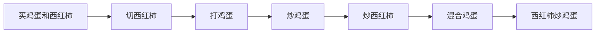
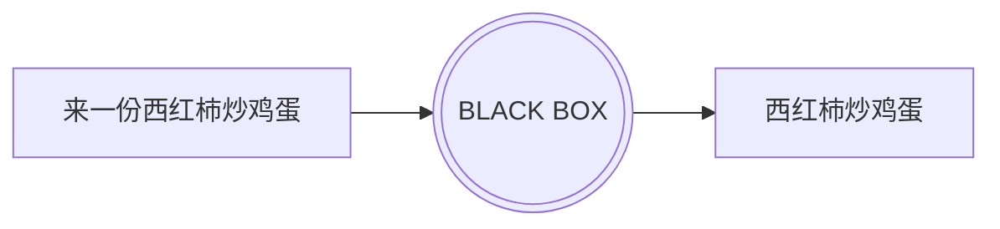
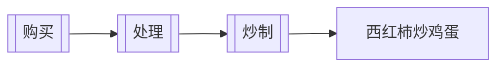

# Functional Programming

---
layout: table-of-contents
hideInToc: true
---

# Table of Contents

---

# Imperative Programming

In computer science, imperative programming is a programming paradigm of software that uses statements that change a program's state. In much the same way that the imperative mood in natural languages expresses commands, an imperative program consists of commands for the computer to perform. Imperative programming focuses on **describing how a program operates step by step**, rather than on high-level descriptions of its expected results.

---

# Declarative programming

In computer science, declarative programming is a programming paradigm—a style of building the structure and elements of computer programs—that expresses the logic of a computation without describing its control flow.

---

# Functional Programming

In computer science, **functional programming is a programming paradigm where programs are constructed by applying and composing functions.** 

In functional programming, **functions are treated as first-class citizens**, <u>*meaning that they can be bound to names (including local identifiers), passed as arguments, and returned from other functions, just as any other data type can.* </u>This allows programs to be written in a declarative and composable style, where small functions are combined in a modular manner.

Functional programming has its roots in academia, **evolving from the lambda calculus.**

---

# λ Calculus

Lambda calculus (λ-calculus), originally created by Alonzo Church, is the world’s smallest programming language. Despite not having numbers, strings, booleans, or any non-function datatype, **lambda calculus can be used to represent any Turing Machine!**1

|Name|Syntax|Example|Explanation|
|---|---|---|---|
|Variable|`<name>`|`x`|a variable named “x”|
|Function|`λ<parameters>.<body>`|`λx.x`|a function with parameter “x” and body “x”|
|Application|`<function><variable or function>`|`(λx.x)a`|calling the function “λx.x” with argument “a”|

The most basic function is the identity function: `λx.x` which is equivalent to $f(x) = x$. The first “x” is the function’s argument, and the second is the body of the function.

<Footnotes separator>
  <Footnote :number=1><a href="https://learnxinyminutes.com/docs/lambda-calculus/" rel="noreferrer" target="_blank">Lambda Calculus</a></Footnote>
</Footnotes>

